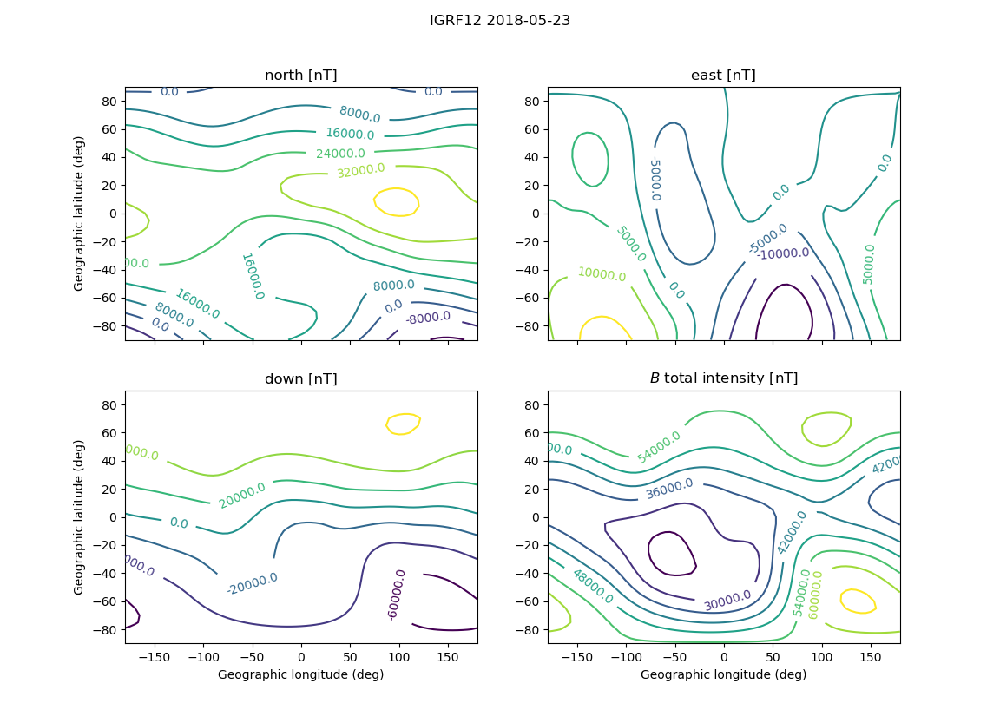

[](https://travis-ci.org/scivision/igrf12)
[](https://coveralls.io/github/scivision/igrf12?branch=master)
[](https://ci.appveyor.com/project/scivision/igrf12)
[](https://pypi.python.org/pypi/igrf12)
[](http://pepy.tech/project/igrf12)

# IGRF 2012 in Python

International Geomagnetic Reference Field IGRF12 and IGRF11...in simple, object-oriented Python &ge; 3.6 or Matlab.




## Install

A Fortran compiler is required, such as `gfortran`:

* Linux: `apt install gfortran`
* Mac: `brew install gcc`
* [gfortran for Windows](https://www.scivision.dev/windows-gcc-gfortran-cmake-make-install/) (MinGW)

To get the IGRF12 development version, `git clone` and then:
```sh
python -m pip install -e .
```

Otherwise, for the latest release from PyPi:
```sh
python -m pip install igrf12
```

Optionally, test the install with:
```sh
pytest
```

### Windows
If you get ImportError on Windows for the Fortran module, try from the `iri2016` directory:
```posh
del *.pyd
python setup.py build_ext --inplace --compiler=mingw32
```


## Example
To make the plots in this readme:
```sh
igrf12
```

using as a Python module at geodetic coordinates 65N, 148W:
```python
import igrf12

mag = igrf12.igrf('2010-07-12', glat=65, glon=-148, alt_km=100)
```
returns an `xarray.Dataset`:
```
<xarray.Dataset>
Dimensions:  (alt_km: 1)
Coordinates:
  * alt_km   (alt_km) int64 100
Data variables:
    north    (alt_km) float64 1.122e+04
    east     (alt_km) float64 4.148e+03
    down     (alt_km) float64 5.302e+04
    total    (alt_km) float64 5.436e+04
    incl     (alt_km) float64 77.29
    decl     (alt_km) float64 20.29
```

The IGRF model may be specified with the `igrf12.igrf(model=)` option:
* `11`: IGRF11
* `12`: IGRF12

### Matlab
Matlab can seamlessly call Python modules, as in `igrf12.m`.
Instead of the $1000 Aerospace Toolbox, use this free IGRF12 for Matlab.

## Reference

If you only want the plain Fortran program, you can do:

```sh
cd bin

cmake ../src
cmake --build .

./testigrf
```

### References

-   [IGRF12 Fortran code](http://www.ngdc.noaa.gov/IAGA/vmod/igrf12.f)
-   [IGRF11 Fortran code](http://www.ngdc.noaa.gov/IAGA/vmod/igrf11.f)
-   WMM2015 [inclination map](https://www.ngdc.noaa.gov/geomag/WMM/data/WMM2015/WMM2015_I_MERC.pdf)
-   WMM2015 [declination map](https://www.ngdc.noaa.gov/geomag/WMM/data/WMM2015/WMM2015_D_MERC.pdf)
