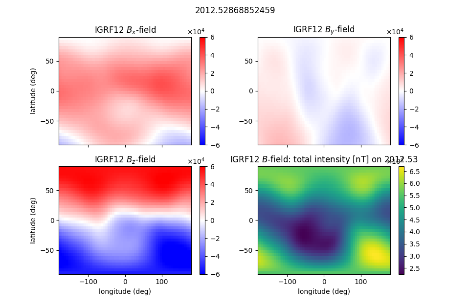

.. image:: https://travis-ci.org/scivision/pyigrf12.svg?branch=master
    :target: https://travis-ci.org/scivision/pyigrf12
    
.. image:: https://coveralls.io/repos/github/scivision/pyigrf12/badge.svg?branch=master
    :target: https://coveralls.io/github/scivision/pyigrf12?branch=master

.. image:: https://img.shields.io/pypi/pyversions/pyigrf12.svg
  :target: https://pypi.python.org/pypi/pyigrf12
  :alt: Python versions (PyPI)

.. image::  https://img.shields.io/pypi/format/pyigrf12.svg
  :target: https://pypi.python.org/pypi/pyigrf12
  :alt: Distribution format (PyPI)

========
igrf12py
========
International Geomagnetic Reference Field IGRF12 and IGRF11...in Python!

:Author Python API: Michael Hirsch, Ph.D.

Install
============
::

    python -m pip install -e .

Run Example
===========
::

    python RunIGRF.py

Reference
=========
If you only want the plain Fortran program, you can do::

    cd bin
    cmake ../fortran
    make
    ./testigrf

References
-----------
http://www.ngdc.noaa.gov/IAGA/vmod/igrf12.f

http://www.ngdc.noaa.gov/IAGA/vmod/igrf11.f
